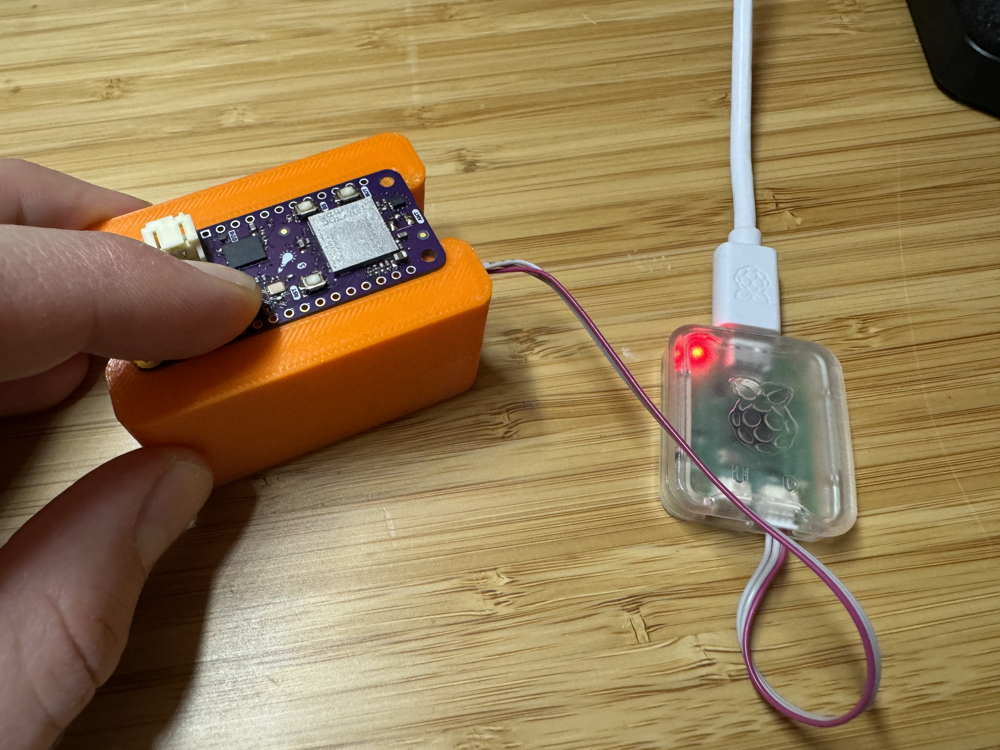
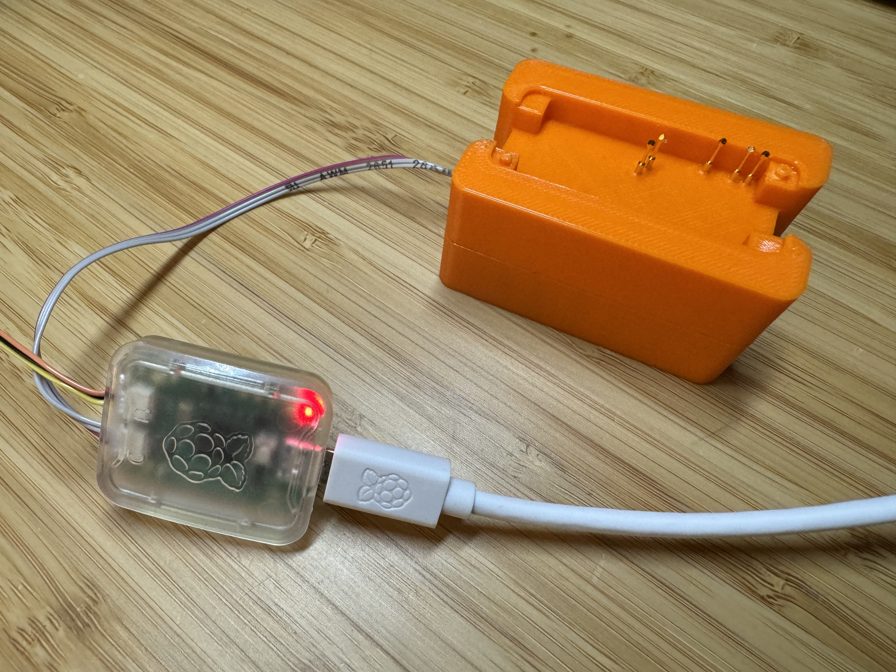

# Overview

Simplify your development process with this compact, 3D-printed programming fixture designed specifically for the nRF9160 and nRF9151 Feather boards.

This fixture enables seamless programming by simply placing your board on top for quick connections. Compatible with both 10-pin JTAG programmers and Raspberry Pi Picoprobe, this tool fits perfectly into your workflow. (Programmer sold separately)

Whether you’re a hobbyist or professional developer, this open-source design ensures flexibility and accessibility. Bring ease to your prototyping and programming with a reliable, user-friendly fixture.

## Where to Buy

You can purchase the Recovery Fixture from the [Circuit Dojo Store](https://www.circuitdojo.com/products/recovery-fixture).

## License

[CERN Open Hardware Licence Version 2 - Weakly Reciprocal](https://github.com/circuitdojo/nrf91xx-feather-recovery-fixture#CERN-OHL-W-2.0-1-ov-file)
